# Manual for garments published on [a]industri open-source on CLO-SET CONNECT.

> [!TIP]
> See GitHub's markdown table of contents above.

## Introduction

This manual contains guidelines and technical specifications required for patterns and visualisations to be published under [a]industri Open Source Production Patterns (OSPP) on CLO-SET CONNECT.

The patterns of the styles shared through this platform should be ready for production. I.e. include all information such as seam allowance, notches, grading etc needed for industrial production.

Please visit CLO-SET CONNECT> Help Centre> CLO-SET CONNECT Manual for general guidelines regarding [CLO-SET CONNECT](https://support.clo-set.com/hc/en-us/categories/360000184736-USING-CLO-SET).

## Organising pattern pieces in 2D window

- The 2D patterns should be grouped and organised so that pieces can be easily recognised in the 2D window, please see the layout below.
- Use the “Symmetric Pattern” function on all pattern pieces that are symmetrical.
- Check that the grain lines are marked correctly.

> [!NOTE]
> 
> Left: Example top pieces
> 
> Right: Example bottom pieces

## Annotations and names on pattern pieces

Use the pattern annotation function to add information to the pattern pieces if needed, i.g. ease, pleats etc.

Give each pattern piece explanatory names in the property editor (not as annotations) so that they can be recognized in the 2D window and after the have been printed out for production, eg. RHS Front, Back, RHS Sleeve, Top Collar etc. Denote Right and Left with RHS (right hand side) or LHS (Left Hand Side).

> [!NOTE]
> 
> Left: Example of annotation
> 
> Right: Naming pattern piece

## Fusing

Fused parts need to be marked for production. Use the bond function for this

Bond the full piece if it should be block fused, i.e fused before cutting (this normally applies to pocket pieces, waistbands, jacket collars etc.).

> [!NOTE]
> 
> Example: Block fused pattern piece

### Fusing inside of a pattern piece

- Create an internal shape inside of a pattern piece.
- Choose the Bond function under “Property Editor”. Then the pattern for the fusing is automatically created in the Print Layout Bond window.

### Fusing outside of/along a pattern outline

- Fusing pieces must be 2 mm smaller than the seam allowance in order work well in the fusing machine.
- Right click on the selected lines and use “Offset as internal line (Reversed Direction)” to create the outlines of the fusing piece.
- Complete the fused area by drawing internal lines. If needed, right click on the overlapping pointsand join them to create an internal shape, mark it and choose Bond in the property editor.
- Check the grain line of the fusing under the fusing tab in the Print Layout mode (scroll down menu in the top right corner).

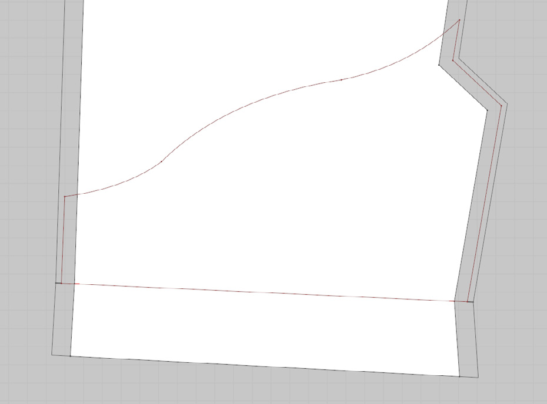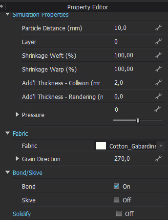
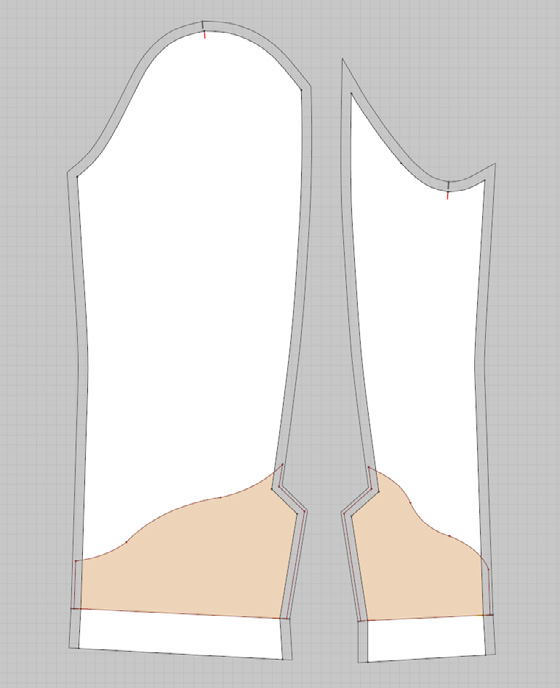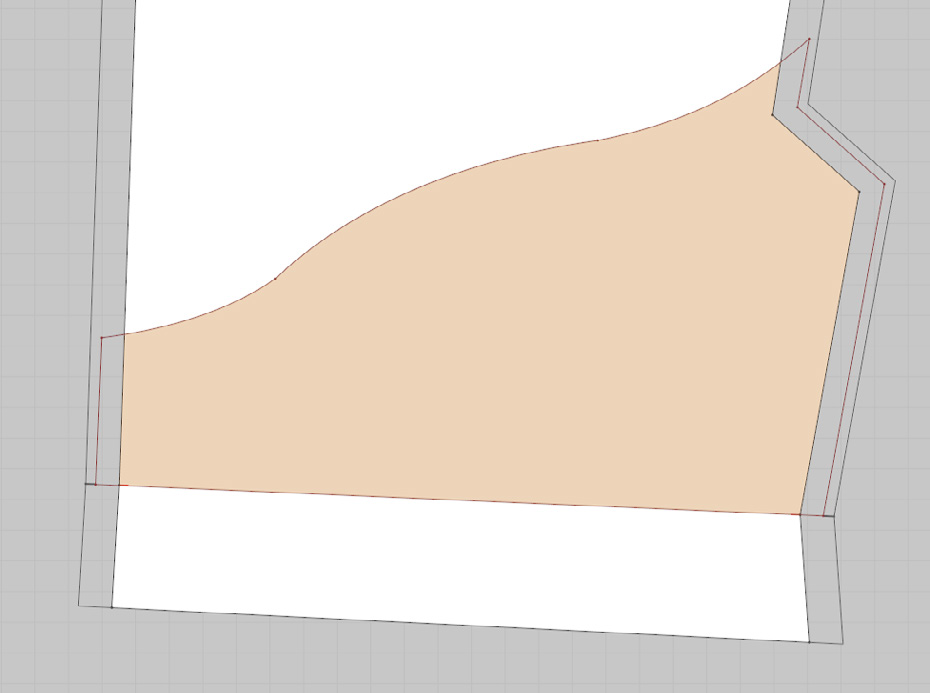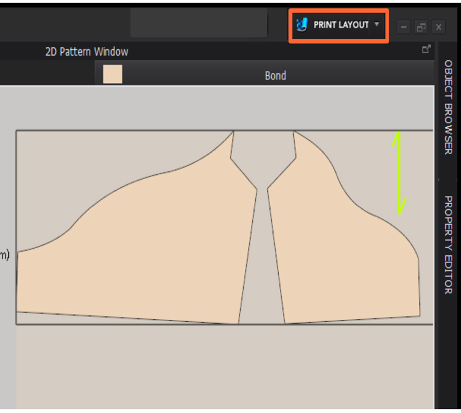

## Seam allowance

All pattern pieces should include a seam allowance for the physical production.

Add the proper seam allowance according to the sewing method with the seam allowance tool in the 2D window.

| | Stitch type | Seam allowance | Description |
| :-: | - | - | - |
|| 1-Needle Lockstitch | 1 cm | 1 cm is generally used for 1-needle lockstitch seams. |
|| Stiched and turned 1-Needle Lockstitch | 0,5 cm | 0,5 cm is generally used for stitched and turned 1-needle lockstitch seams, eg. edges of collars and cuffs. |
|| 4-thread overlock | 0,7 cm | The overlock seam is generally 0,5 cm wide. 2 mm margin is added to be cut away when sewing. |
|| 5-thread safety stitch | 1,2 cm | The overlock plus chainstitch seam is generally 1 cm wide together. 2 mm margin is added to be cut away when sewing. |

> [!NOTE]
>
> Example of seam allowence according to different stiching.

> [!IMPORTANT]
>
> The seam allowance is only for joining seams and part of pieces “inside” of a seam, generally NOT for fold and hems. See explanation in Seam allowance in 3D window.

### Seam allowance for hems and folds

To facilitate simlulation, and to be able to adjust stylelines in Jinny (or in the 3D window), we recommend hemfolds are marked as seam allowance.

Make sure that the correct seam allowance angles are used if the ends are not 90 degrees.

However, when handling hemfolds like this the inside of the hem is not visible in the 3D visualisation or rendering.

**If** there is a need for inside hem visualisation, e.g. if the front and back side of the fabric has different textures or colours, add the by unfolding the hem. Use the fold tool to make a nive hemfold and add seamallowence as on the image below.

### Seam allowance for darts

If darts should not be cut open, i.e up to 2 cm wide, use internal lines at each dart leg and in the middle. Apply fold values to the internal lines and fold in desired direction. Use the mesh tool from the 3d menu to subdivide the mesh of the dart to make it smooth. (below left)

If the dart should be cut open, leave the dart open and add seam allowance (below right).

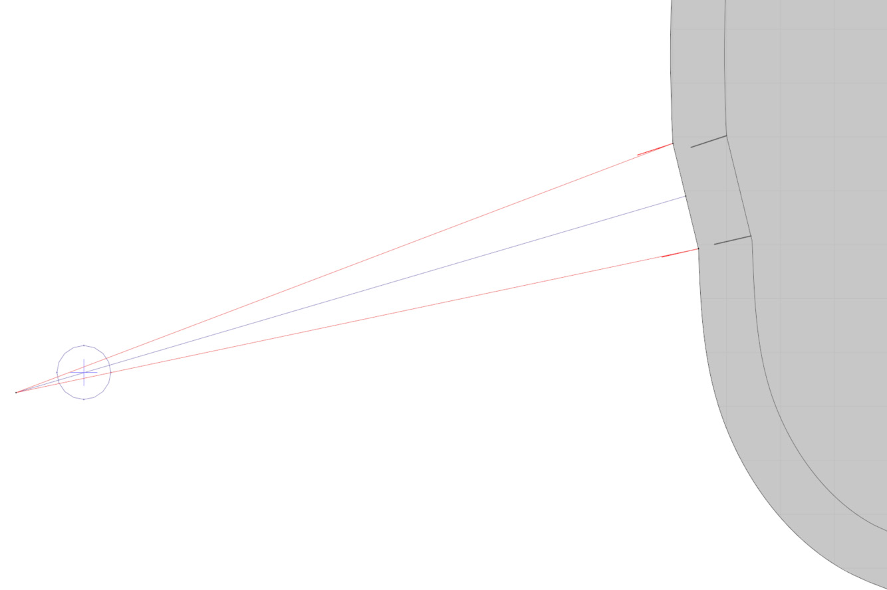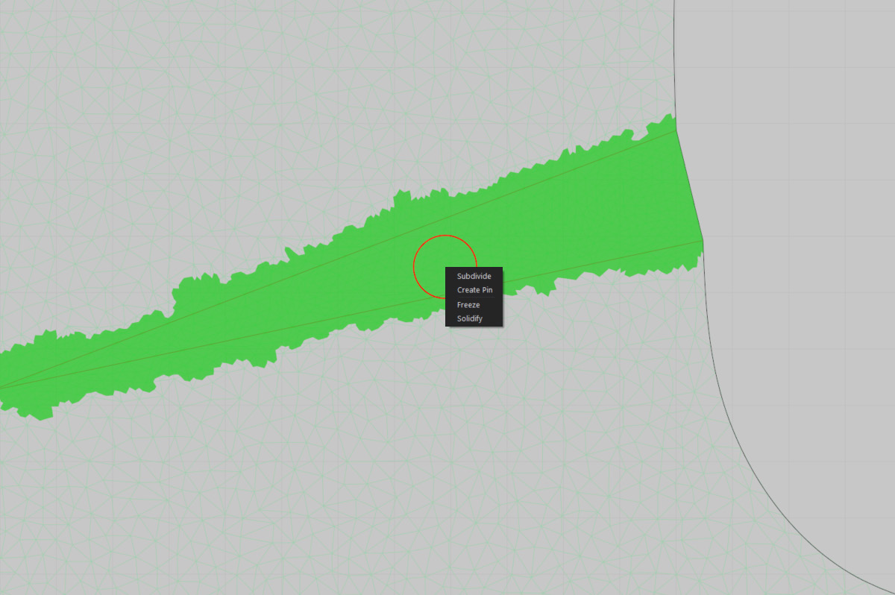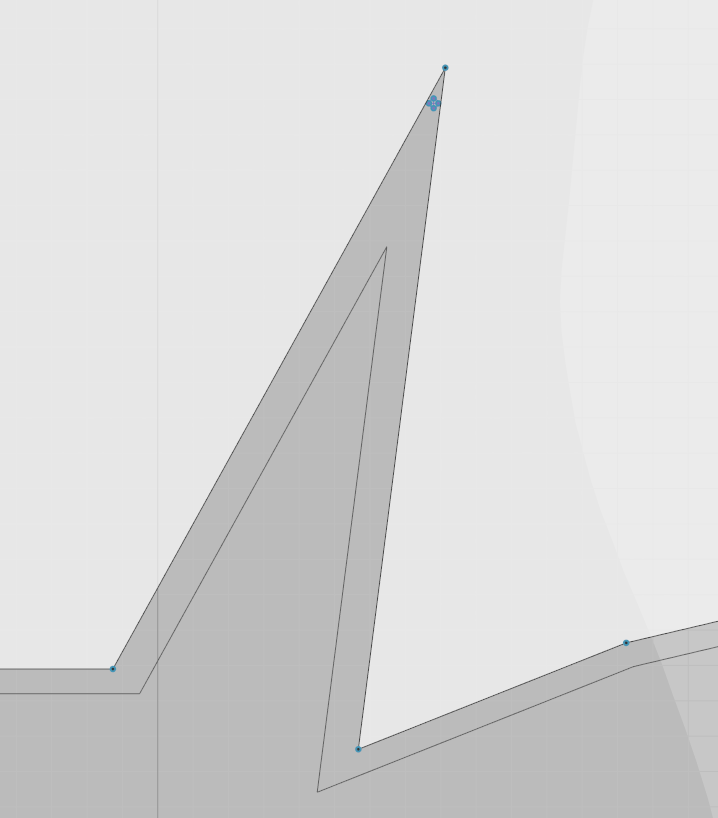

> [!NOTE]
>
>  Left, Center: Example *not* cut-open dart
>
>  Right: Example cut-open dart

## Topstitches

Use, as far as posible, the pre-defined topstitches with ISO-codes suplied by CLO. Topstiches for OSPP should be colored white.

Place, as far as possible, toptitches on the outlines of the patterns and offset if needed. **Avoid unnecessary internal lines.**

## Trims

### Buttons

- Add button and bottonholes using the tool in the 3d window. Make sure to lock the button into position if possible.
- Adjust size according and color the buttons white.
- Mark drillhole on correct facing of the fabricpiece.

### Buckles and other imported 3d objects

- Add trim infomation about the object in the property editor and tick off *include in techpack*.
- Adjust size according and color the buttons white or black.

### Elastics, cords and velcro pieces

- Add piece as a regular patternpiece, name and archive it.
- **Change from pattern to trim** in the property editor, tick off *include in techpack* and choose trim classification.
- Add fabric and texture matching the trim.

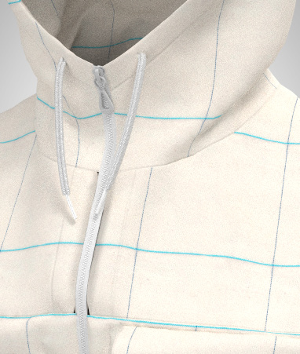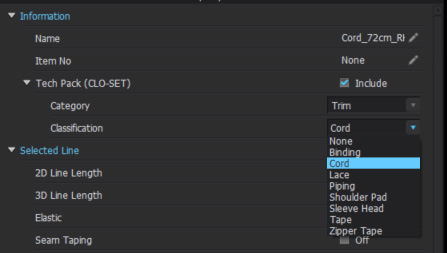

## Notches and drill holes

### Notches

- ONLY add notches that are necessary for the physical production to your pattern. Notches should be helpful when sewing, i.e **no** notches for marking centre front, waist lines, places of measure etc.
- Place notches on long and/or curved lines notches every 20-40cm to facilitate assemling.
- Hem and fold lines should be marked with notches.

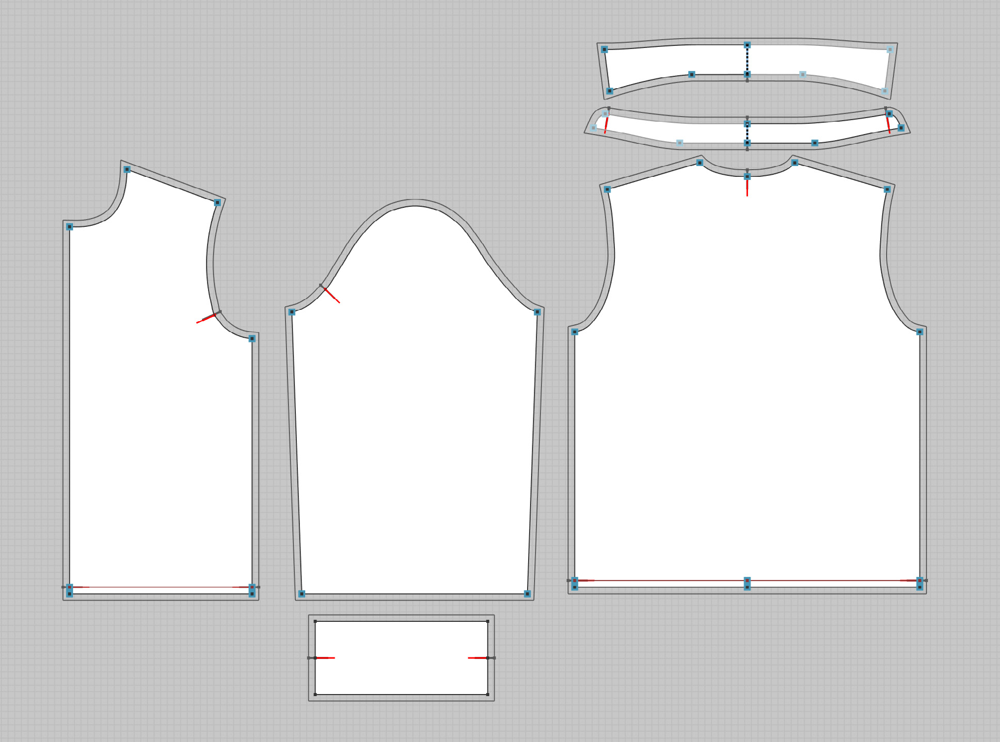

> [!NOTE]
>
> Examples:
>
> 1. Joining notches.
>    1. Note: Always place a notch 8 cm from sideseam front pcs and front side of sleeve.
> 1. Notches to mark foldline.
> 1. Notches to mark folded hemline.

### Drill holes

## Point of measureme (POM)

## Grading

### Example shirt

### Example pants

## Visualisation

## Preparations for uploading and rendering

## Rendering of thumbnails and subimages

## Submitting designs to OSPP
